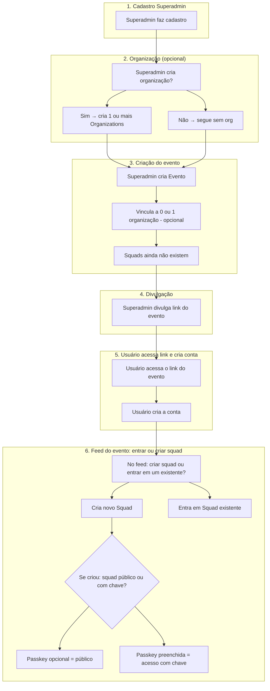
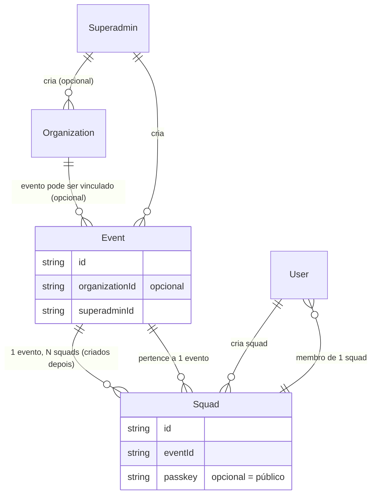

# Fluxo: Superadmin → Organização → Evento → Usuários → Squads

## Visão geral do fluxo

## Relações no modelo de dados

## Resumo por etapa

| Etapa | Quem              | O quê                                                            | Opcional?                                                 |
| ----- | ----------------- | ---------------------------------------------------------------- | --------------------------------------------------------- |
| 1     | Superadmin        | Cadastro                                                         | —                                                         |
| 2     | Superadmin        | Criar 0, 1 ou mais Organizations                                 | Sim                                                       |
| 3     | Superadmin        | Criar Evento; vincular a **0 ou 1** organização                  | Vínculo com org é opcional; squads não existem na criação |
| 4     | Superadmin        | Divulgar link do evento                                          | —                                                         |
| 5     | Usuário           | Acessar link → **criar conta**                                   | —                                                         |
| 6     | Usuário           | No **feed do evento**: criar squad **ou** entrar em um existente | —                                                         |
| 7     | Usuário (criador) | Se criou: definir passkey ou deixar público                      | Passkey opcional = squad público                          |

## Regras de negócio

- **Um evento = uma organização** (ou nenhuma). Não há múltiplas orgs por evento.
- Usuário **só participa do evento** ao entrar ou criar um squad no feed; não há “participante sem squad”.

## Schema atual

- **Event.organizationId** é `String?` (opcional): evento pode existir sem organização; no máximo uma.
- **Squads** são sempre criados no feed do evento, por usuários; na criação do evento não há squads.
- **Squad.passkey** é `String?`: `null` = público; preenchido = acesso com chave.

